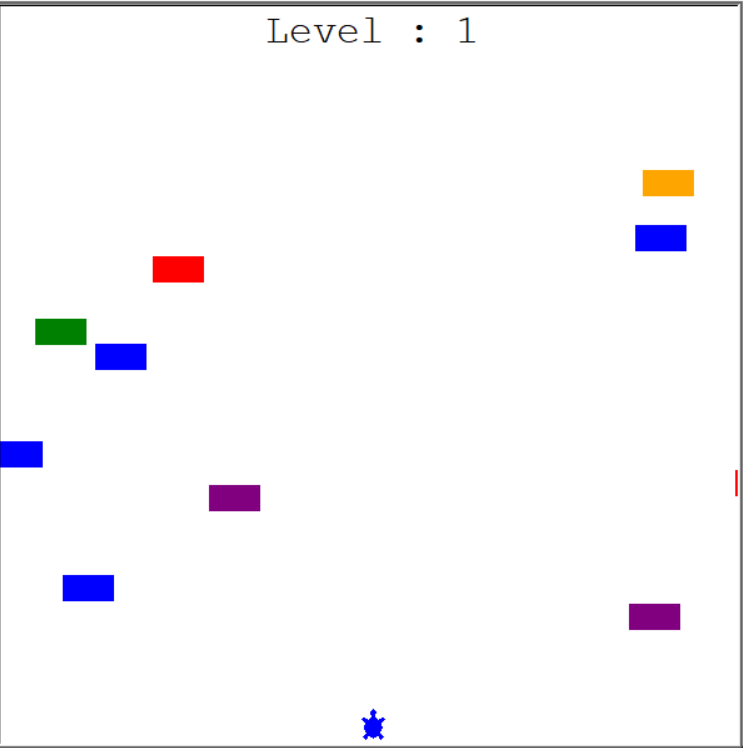

# Turtle-crossing

### This is my new novel game in Python.

</img>
<h1>How does this work?</h1>

  

<h3> Using "W" and "S" keys, one can move turtle up and down, and in turn try his/her best to avoid being hit by the moving "cars"</h3>
<h3> As you reach the finish line your level increases. </h3>

  

<h3> You are free to read the code and suggest necessary pull requests to make the game more efficient</h3>
